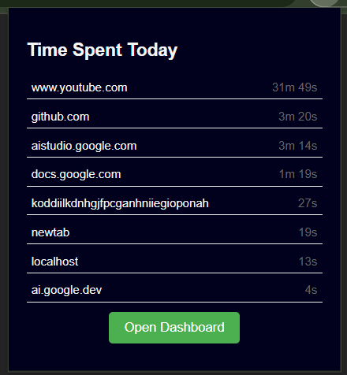

# Site Time Tracker - Chrome Extension

**Site Time Tracker** is a Chrome Extension that helps you monitor the amount of time you spend on each website. It tracks the active time you spend on open tabs and provides a dashboard view listing all sites visited along with the time spent on each. This tool is ideal for productivity tracking, enabling you to analyze and manage your time on different websites.

# Features

- **Time Tracking**: Automatically tracks active time spent on each website in Chrome.
- **Dashboard**: View a detailed breakdown of sites visited and time spent on each.
- **Real-Time Updates**: Time spent is updated in real-time as you navigate across tabs.

# Preview

# Installation

1. Clone or download the repository.
2. ```
   git clone https://github.com/AdityaS1204/site-time-monitor.git
3. Go to chrome settings.
   - extensions
   - manage extensions
4. enable the developer mode
5. unpack the extension file.
